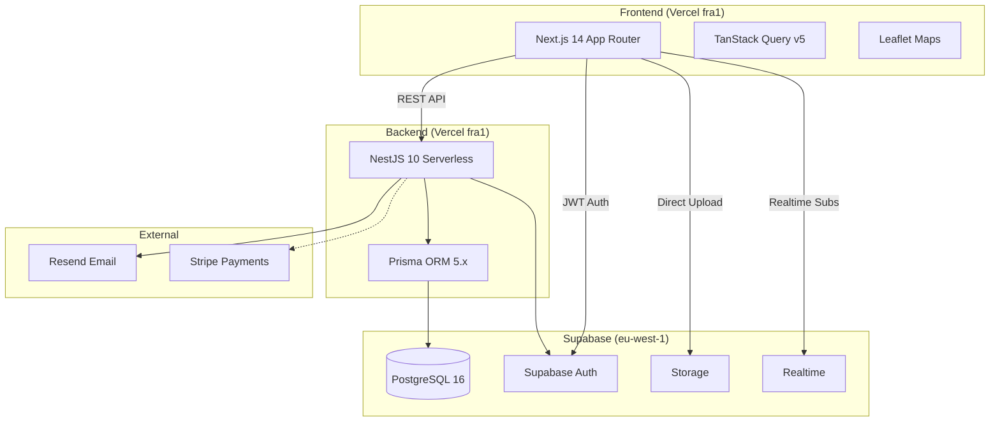

# Arquitectura de GoTogether

## Visión general

GoTogether es una plataforma que conecta personas mayores y personas con discapacidad (**clientes**) con acompañantes verificados (**acompañantes**) para actividades cotidianas. Sigue un modelo de marketplace bilateral con verificación de documentos, chat en tiempo real y sistema de reservas con estados.

## Stack tecnológico



## Decisiones técnicas clave

### ¿Por qué Supabase en vez de base de datos propia?

- **Auth integrada**: magic link sin gestionar passwords ni JWT manualmente
- **Storage**: subida directa de archivos (certificados, avatares) sin pasar por Vercel
- **Realtime**: chat en tiempo real via Postgres Changes sin servidor de WebSockets
- **RLS**: Row Level Security para que cada usuario solo acceda a sus datos
- **Coste**: plan gratuito suficiente para alpha

### ¿Por qué NestJS en Vercel serverless?

- **TypeScript nativo** con decoradores y DI
- **Módulos** bien organizados (13 módulos)
- **Vercel serverless**: despliegue automático desde GitHub, escala a cero, límite 15s
- **Limitación**: no soporta WebSockets → el chat usa Supabase Realtime en vez de Socket.IO

### ¿Por qué Next.js App Router?

- **Server Components**: renderizado híbrido SSR/CSR
- **App Router**: rutas anidadas, layouts compartidos, loading states
- **Middleware**: protección de rutas con Supabase SSR
- **Tailwind CSS**: utilidades atómicas con design system propio (`gt-*`)

## Estructura del monorepo

```
GoTogether/
├── apps/
│   ├── api/                         # NestJS backend
│   │   ├── api/index.ts             # Entry point Vercel serverless
│   │   ├── prisma/schema.prisma     # 14 modelos PostgreSQL
│   │   └── src/
│   │       ├── main.ts              # Entry point desarrollo local
│   │       ├── generated/client/    # Prisma Client autogenerado
│   │       └── modules/             # 16 módulos NestJS
│   └── web/                         # Next.js frontend
│       └── src/
│           ├── app/                 # App Router (28+ rutas)
│           ├── components/          # Componentes React reutilizables
│           ├── lib/                 # Utilidades, schemas Zod, rutas
│           ├── services/            # Cliente API REST
│           └── types/               # Tipos TypeScript
├── packages/
│   ├── shared/                      # Tipos compartidos (@gotogether/shared)
│   └── ui/                          # Componentes UI (@gotogether/ui)
├── infra/docker/                    # Servicios locales (postgres, redis, minio)
└── docs/                            # Documentación (esta carpeta)
```

## Flujo de datos principal

### Registro de usuario
```
Cliente → Next.js → Supabase Auth (magic link) → NestJS (sync user) → Prisma → PostgreSQL
```

### Subida de archivos
```
Navegador → Supabase JS Client → Supabase Storage (bucket certificates/avatars)
                                    ↓
                               URL pública → guardada en Profile/CompanionProfile via API
```

### Reserva (booking)
```
Cliente → /explorar → elige acompañante → /solicitud?companionId=X
           → POST /bookings (DRAFT) → PUT /bookings/:id/request (REQUESTED)
Acompañante → /panel → ve solicitud → PUT /bookings/:id/status (ACCEPTED)
           → se crea ChatRoom → se notifica a ambos
```

### Chat en tiempo real
```
Usuario A → INSERT en ChatMessage via Supabase JS
              ↓
         Supabase Realtime (Postgres Changes)
              ↓
Usuario B → recibe mensaje en tiempo real (< 100ms)
```

### Verificación de documentos
```
Admin → /admin → ve documentos subidos (PDFs)
      → PUT /admin/companions/:id/verify
      → CompanionProfile.verified = true
      → Acompañante aparece en /explorar
```

## Límites del plan gratuito (alpha)

| Recurso | Límite | Uso actual |
|---------|--------|-----------|
| Proyectos Supabase | 2 | 1 |
| Base de datos | 500 MB | < 10 MB |
| Auth usuarios | Ilimitado | < 100 |
| Storage | 1 GB | < 5 MB |
| Realtime concurrentes | 200 | < 10 |
| Realtime mensajes/mes | 2M | < 10K |
| Vercel serverless (Hobby) | 100 GB-horas | < 1 GB-hora |
| Vercel bandwidth | 100 GB | < 1 GB |

> [!warning] Si el proyecto crece más allá de estos límites, será necesario migrar la API de Vercel serverless a Fly.io o Railway para soportar WebSockets nativos, y pasar a plan Pro de Supabase.
