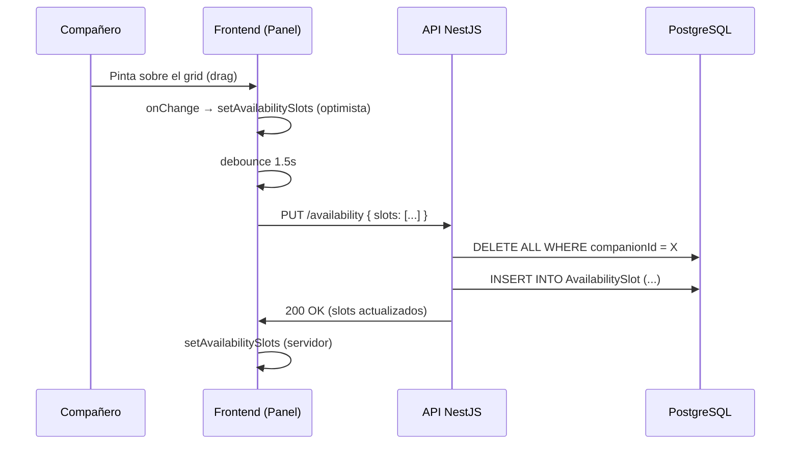
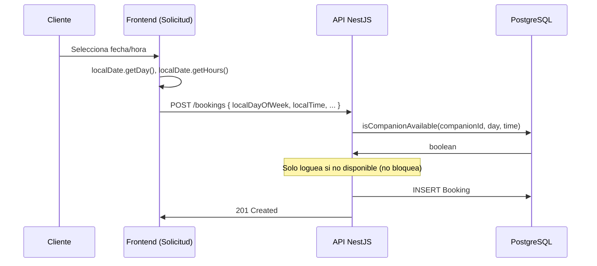

# Sistema de Disponibilidad

**Archivo principal:** `apps/api/src/modules/availability/availability.service.ts`
**Componente frontend:** [[frontend/components#availabilitygrid|AvailabilityGrid]]
**Tests:** `availability.service.spec.ts` (6 tests)

## Descripción

El sistema de disponibilidad permite a los acompañantes definir sus franjas horarias semanales. Los clientes las ven como referencia a la hora de solicitar un servicio, pero **la disponibilidad es puramente orientativa**: pueden solicitar aunque el acompañante no tenga disponibilidad marcada.

## API Endpoints

| Método | Ruta | Auth | Descripción |
|--------|------|------|-------------|
| `GET` | `/companions/:id/availability` | JWT | Obtener slots semanales de un acompañante |
| `PUT` | `/availability` | JWT | Guardar disponibilidad (reemplaza todos los slots) |

### Body de `PUT /availability`
```json
{
  "slots": [
    { "dayOfWeek": 1, "startTime": "09:00", "endTime": "12:30" },
    { "dayOfWeek": 1, "startTime": "14:00", "endTime": "18:00" },
    { "dayOfWeek": 3, "startTime": "08:00", "endTime": "13:00" }
  ]
}
```

## Modelo de datos

```prisma
model AvailabilitySlot {
  id           String   @id @default(uuid())
  companionId  String
  dayOfWeek    Int         // 0=Dom, 1=Lun, ..., 6=Sáb
  startTime    String      // "HH:MM"
  endTime      String      // "HH:MM"
  createdAt    DateTime @default(now())
  updatedAt    DateTime @updatedAt

  companion    CompanionProfile @relation(fields: [companionId], references: [id])

  @@index([companionId, dayOfWeek])
  @@map("AvailabilitySlot")
}
```

## Flujo completo

### 1. Compañero configura disponibilidad



### 2. Cliente solicita servicio



## `isCompanionAvailable()`

```typescript
async isCompanionAvailable(
  companionId: string,
  scheduledAt: Date,
  localDayOfWeek?: number,  // día en zona horaria del navegador
  localTime?: string,         // "HH:MM" en zona horaria del navegador
): Promise<boolean>
```

- Si `localDayOfWeek` y `localTime` están presentes → se usan directamente
- Si no → se derivan de `scheduledAt` (compatibilidad hacia atrás)
- Query: `dayOfWeek == X AND startTime <= timeStr AND endTime >= timeStr`

## Timezone Fix

La disponibilidad se define en **hora local española** (CET/CEST). El frontend envía `localDayOfWeek` y `localTime` calculados con `new Date().getDay()` y `getHours()` en el navegador del usuario, garantizando que coinciden con la zona horaria local.

```
Frontend:
  localDate = new Date("2026-06-15T10:00:00")  // browser local time
  localDayOfWeek = localDate.getDay()            // 1 (Lunes)
  localTime = "10:00"                            // HH:MM local

Backend:
  isCompanionAvailable(compId, isoDate, 1, "10:00")
  → query: dayOfWeek=1 AND "10:00" BETWEEN startTime AND endTime
```

## Validaciones

| Validación | Tipo | Descripción |
|-----------|------|-------------|
| `endTime > startTime` | Server | `BadRequestException` si `endTime <= startTime` |
| Solo acompañantes | Server | `ForbiddenException` si el usuario no tiene `CompanionProfile` |
| Formato de hora | DTO | `@Matches(/^([01]\d\|2[0-3]):[0-5]\d$/)` |
| día de la semana | DTO | `@Min(0) @Max(6)` |

## Frontend: AvailabilityGrid

El grid usa half-hour slots (08:00-19:30). Ver [[frontend/components#availabilitygrid|documentación del componente]].

### Interacción
1. **Drag para pintar:** pointerdown inicia, pointermove extiende, pointerup consolida
2. **Click en cabecera:** togglea todas las celdas del día
3. **Optimista:** cambios visuales instantáneos vía `useRef`, `onChange` solo al soltar
4. **Debounced save:** 1.5s de inactividad → `PUT /availability`

## Migraciones

| Fecha | Descripción |
|-------|-------------|
| Mayo 2026 | `add_availability_updated_at_and_index` — Añade `updatedAt` y `@@index([companionId, dayOfWeek])` |
