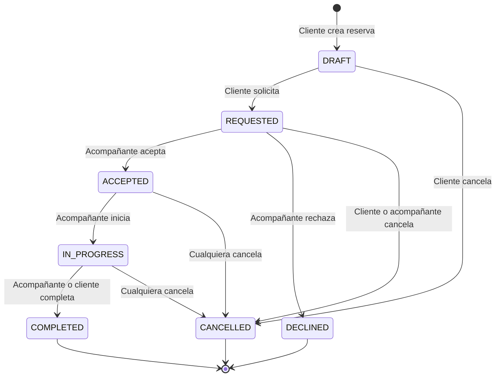

# Máquina de Estados de Reservas

**Archivo principal:** `apps/api/src/modules/bookings/bookings.service.ts`
**Tests:** `bookings.service.spec.ts` (30 tests)

## Estados y transiciones



## VALID_TRANSITIONS

```typescript
const VALID_TRANSITIONS: Record<BookingStatus, BookingStatus[]> = {
  DRAFT:        [REQUESTED, CANCELLED],
  REQUESTED:    [ACCEPTED, DECLINED, CANCELLED],
  ACCEPTED:     [IN_PROGRESS, CANCELLED],
  DECLINED:     [],
  IN_PROGRESS:  [COMPLETED, CANCELLED],
  COMPLETED:    [],
  CANCELLED:    [],
};
```

Las transiciones no listadas lanzan `BadRequestException`.

## Permisos por transición

| Transición | Quién puede | Validación |
|-----------|-------------|------------|
| DRAFT → REQUESTED | Cliente (o supervisor del cliente) | `isClient \|\| isSupervisedClient` |
| REQUESTED → ACCEPTED | Acompañante asignado o cualquier acompañante (claim) | `isCompanion \|\| canClaim` |
| REQUESTED → DECLINED | Acompañante asignado o cualquier acompañante (claim) | `isCompanion \|\| canClaim` |
| ACCEPTED → IN_PROGRESS | Acompañante asignado | `isCompanion` |
| IN_PROGRESS → COMPLETED | Acompañante o cliente | `isCompanion \|\| isClient` |
| ANY → CANCELLED | Cliente, acompañante, o supervisor | `isClient \|\| isCompanion \|\| isSupervisedClient` |

### `canClaim`
Si un acompañante (con `CompanionProfile`) acepta una reserva que no tiene `companionId` asignado (open booking), se asigna automáticamente `updateData.companionId`.

## Participantes

```typescript
const isClient = booking.clientId === userId;
const isCompanion = user.profile?.companion && booking.companionId === user.profile.companion.id;
const canClaim = user.profile?.companion && !booking.companionId;
const isSupervisedClient = await isSupervisorOf(userId, booking.clientId);
```

## Efectos secundarios automáticos

| Evento | Efectos |
|--------|---------|
| Reserva ACCEPTED | Crea `ChatRoom` + notifica al cliente + email al cliente |
| Reserva DECLINED | Notifica al cliente + email al cliente |
| Servicio COMPLETED | Notifica al cliente (valorar) + email al cliente |
| Reserva CANCELLED (por compañero) | Notifica al cliente + email al cliente |
| `requestCompletion()` | Notifica al cliente que confirme finalización |
| `completeByClient()` | Notifica al compañero + email al cliente |

## Endpoints relacionados

| Método | Ruta | Descripción |
|--------|------|-------------|
| `POST` | `/bookings` | Crear reserva (DRAFT) |
| `GET` | `/bookings/me` | Mis reservas (rol-aware) |
| `GET` | `/bookings/open` | Reservas REQUESTED sin compañero (marketplace) |
| `GET` | `/bookings/:id` | Detalle de reserva |
| `PUT` | `/bookings/:id/request` | Solicitar (DRAFT → REQUESTED) |
| `PUT` | `/bookings/:id/status` | Cambiar estado |
| `PUT` | `/bookings/:id/request-completion` | Acompañante solicita finalizar |
| `PUT` | `/bookings/:id/complete` | Cliente confirma finalización |
| `GET` | `/bookings/history` | Historial paginado |
| `GET` | `/bookings/stats` | Estadísticas (completadas, valoración media) |

## Flujo completo de reserva

1. **Cliente crea** → `POST /bookings` → DRAFT
2. **Cliente solicita** → `PUT /bookings/:id/request` → REQUESTED (notifica al compañero si hay companionId)
3. **Compañero acepta** (desde Panel) → `PUT /bookings/:id/status { ACCEPTED }`
   - Asigna companionId (si es claim)
   - Crea ChatRoom
   - Notifica al cliente
4. **Compañero inicia** → `PUT /bookings/:id/status { IN_PROGRESS }`
5. **Compañero solicita finalizar** → `PUT /bookings/:id/request-completion`
   - Notifica al cliente
6. **Cliente confirma** → `PUT /bookings/:id/complete`
   - Cambia a COMPLETED
   - Notifica al compañero
   - Email al cliente
7. **Cliente valora** → `POST /reports/:bookingId`
   - Recalcula rating del compañero

## Flujo alternativo: supervisión

Un **supervisor** puede actuar en nombre de su cliente supervisado:
- `POST /bookings` con `bookedById` = supervisor, `clientId` = cliente
- `PUT /bookings/:id/request` el supervisor solicita en nombre del cliente
- `PUT /bookings/:id/status { CANCELLED }` el supervisor cancela

La validación usa `isSupervisorOf(userId, clientId)` que consulta la tabla `Supervision`.
