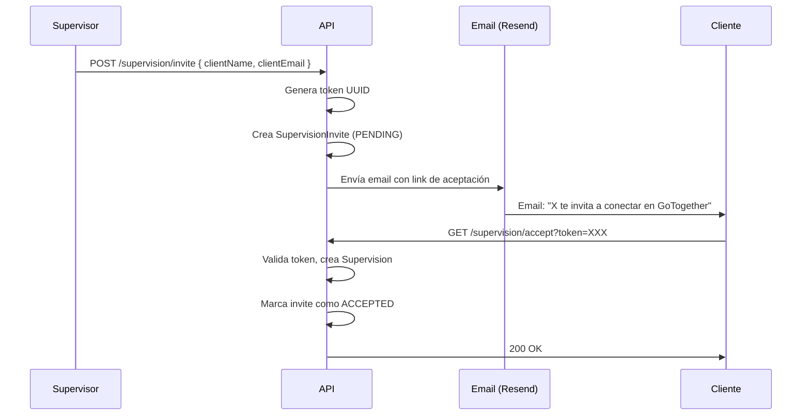

# Sistema de Supervisión

**Archivo principal:** `apps/api/src/modules/supervision/supervision.service.ts`
**Tests:** `supervision.service.spec.ts` (15 tests)

## Descripción

La supervisión permite a familiares o tutores (**supervisores**) gestionar las reservas de las personas a su cargo (**clientes**). Un supervisor puede:
- Vincularse a clientes existentes
- Invitar a nuevos usuarios por email
- Ver todas las reservas de sus clientes
- Ver la ubicación en tiempo real de sus clientes
- Crear reservas en nombre de sus clientes

## Modelos

```
User (SUPERVISOR) ──1:N── Supervision (supervisorId)
User (CLIENT)     ──1:1── Supervision (clientId, @unique)
User (SUPERVISOR) ──1:N── SupervisionInvite (supervisorId)
```

### Supervision
```prisma
model Supervision {
  id           String @id @default(uuid())
  supervisorId String
  clientId     String @unique   // Un cliente solo puede tener UN supervisor
  createdAt    DateTime @default(now())
}
```

### SupervisionInvite
```prisma
model SupervisionInvite {
  id           String @id @default(uuid())
  supervisorId String
  clientName   String
  clientEmail  String?
  clientId     String?
  token        String @unique
  status       String @default("PENDING")  // PENDING | ACCEPTED | CANCELLED
  createdAt    DateTime @default(now())
  updatedAt    DateTime @updatedAt
}
```

## Endpoints API

| Método | Ruta | Auth | Descripción |
|--------|------|------|-------------|
| `POST` | `/supervision` | JWT | Vincular con cliente existente |
| `POST` | `/supervision/invite` | JWT | Invitar por email (genera token) |
| `GET` | `/supervision/accept?token=` | Pública | Aceptar invitación |
| `GET` | `/supervision/invites` | JWT | Invitaciones pendientes |
| `DELETE` | `/supervision/invite/:id` | JWT | Cancelar invitación |
| `GET` | `/supervision/clients` | JWT | Clientes supervisados |
| `GET` | `/supervision/supervisor` | JWT | Mi supervisor |
| `DELETE` | `/supervision/:id` | JWT | Eliminar supervisión |
| `GET` | `/supervision/bookings` | JWT | Reservas de clientes supervisados |

## Validaciones

| Regla | Error |
|-------|-------|
| Solo supervisores pueden crear/gestionar | `ForbiddenException` |
| No puedes supervisarte a ti mismo | `ForbiddenException` |
| Un SUPERVISOR no puede ser supervisado | `ForbiddenException` |
| Un cliente solo puede tener un supervisor | `ConflictException` |
| Invitación ya aceptada/rechazada | `ConflictException` |
| Solo el creador puede cancelar su invitación | `ForbiddenException` |

## Flujo de invitación



## Ubicación en tiempo real

### Modelo ClientLocation
```prisma
model ClientLocation {
  id        String   @id @default(uuid())
  clientId  String   @unique
  latitude  Float
  longitude Float
  accuracy  Float?
  timestamp DateTime @default(now())
}
```

- El cliente activa "Compartir ubicación" desde su perfil
- El hook `useLocationSharing` usa `navigator.geolocation.watchPosition` (15s interval)
- Sube a Supabase `ClientLocation` con upsert
- El supervisor ve las posiciones en un mapa Leaflet (`ClientLocationMap`)
- Realtime: `postgres_changes` en `ClientLocation`

### RLS en ClientLocation
- **SELECT:** dueño (`clientId` = auth.uid()) + supervisor
- **INSERT/UPDATE:** solo el dueño

## Frontend: Página de Supervisión

3 pestañas:
1. **Mis supervisados:** buscar, vincular, eliminar clientes. Gestionar invitaciones pendientes.
2. **Reservas de clientes:** tabla paginada con todas las reservas de los supervisados (agregadas de todos los clientes).
3. **Ubicación:** mapa Leaflet con marcadores coloreados por cliente. Popups con nombre, timestamp, precisión.

### Control de acceso
El middleware solo verifica autenticación (JWT válido). El control de rol se hace en el componente `SupervisionPage`: al montar, llama a `syncUser()` y comprueba `user.role === 'SUPERVISOR'`. Si no lo es, redirige a `/perfil`.
